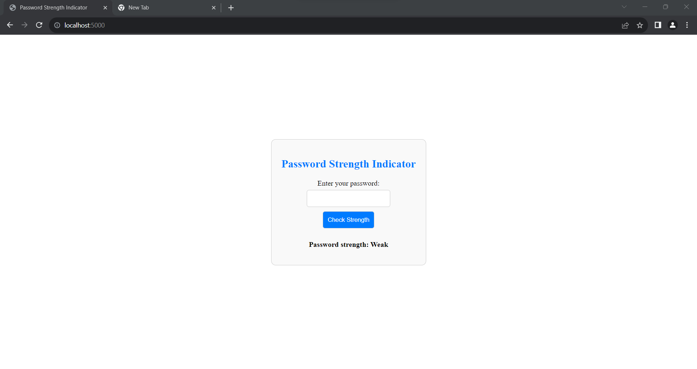

# Password Strength Indicator

> A simple web application that uses python code to checks and displays the strength of passwords for a login page.

---

## Table of Contents

- [Description](#description)
- [Features](#features)
  
- [Installation](#installation)

---

## Description

The Password Strength Indicator is a web application built with Python and Flask that helps users assess the strength of their chosen passwords when creating or updating their login credentials. It takes various factors into account, such as password length, the presence of uppercase and lowercase letters, digits, and special characters.

---

## Features

- Visual password strength indicator (Weak, Medium, Strong).
- Password length analysis.
- Checks for uppercase and lowercase letters, digits, and special characters.
- User-friendly interface for entering passwords.

---

---

## Installation

1. Install the required dependencies:

~~~bash
pip install -r requirements.txt 

##Run the application:

python app.py

## Open a web browser and navigate to http://localhost:5000 to use the application.

